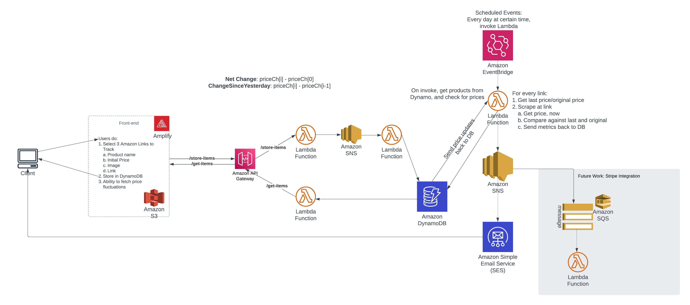

# Price Tracking Application: Track Price Changes of Amazon.com Products

## Overview

Create a price tracking system for products on Amazon. There are discounts offerred on products throughout the year
on Amazon, and if you want to buy a product at a set target price, running a single script manually everyday is cumbersome.
You want to be notified about it with a system running 24/7 in the background. This is my attempt at creating a serverless application
to keep track of product prices against a target price.

## [# Demo](https://d32obbkkibcaxl.cloudfront.net/)

## System Overview

The general idea behind the design was to decouple the entire system. The client side interacts with an API Gateway that routes traffic to either store or get items (backed by two seperate Lambda functions for each task) from a DynamoDB Table.

At the very basic level, the get-items endpoint queries a Lambda function that queries the DB table for all the tracking items that belong to the user.

For the store-item endpoint, we need decoupling with the use of Amazon SNS, a service that follows the pub/sub architecture. The API Gateway invokes a lambda function that publishes a job to SNS. We have another lambda function as a subscriber to the SNS topic which takes in the job, utilizes the url of the product provided by the user to scrape Amazon for pricing information, and then stores the data in the table. The reason for decoupling was because API Gateway has 29s timeout window. I noticed that the scraping job on average could take up to 2minutes, and while the Lambda with a 15min timeout was okay, the API Gateway was timing out. We don't want the client the get error codes especially when the items would end up in the table.

This implementation introduced a new challenge. With the decoupling in place, whenever a client puts in a request to store an item, the first lambda function would respond with the tracking details of the product which the client could render. However, since that item takes about 2minutes-5minutes to process by the other lambda function, the database still isn't aware of this new item. Therefore, the minute the client refreshes their browser, the new item dissapears. To solve this issue, I leverage caching. When the first lambda responds, I immediately store all the items data on the client's local storage with a timeout of 5-15 minutes. This would allow the client to see their newly put item and after 15minutes, they would start seeing the item from the database all the while the idea of database store is abstracted away. This also enables us to reduce the load on the AWS services in the backend with caching.

**Note** This is a current repository and the code is not final.

# [#Issues](https://github.com/farhan0167/price-tracker/issues)

